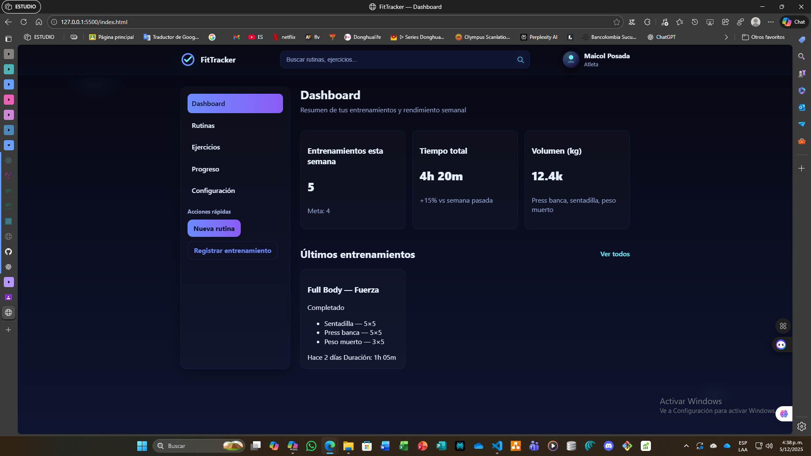
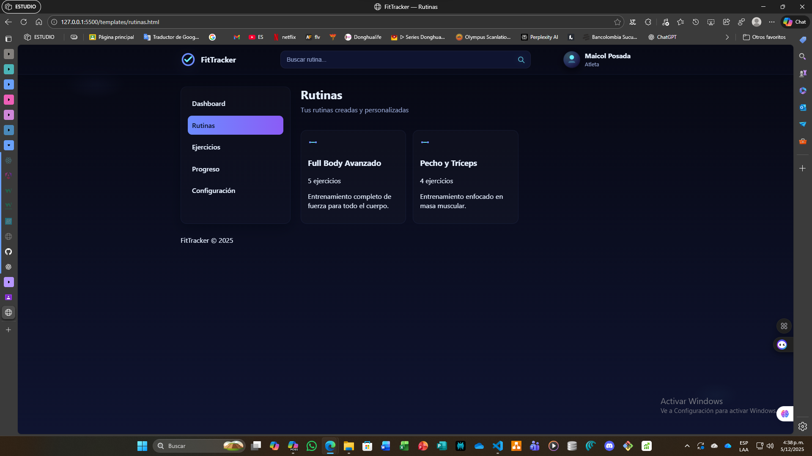
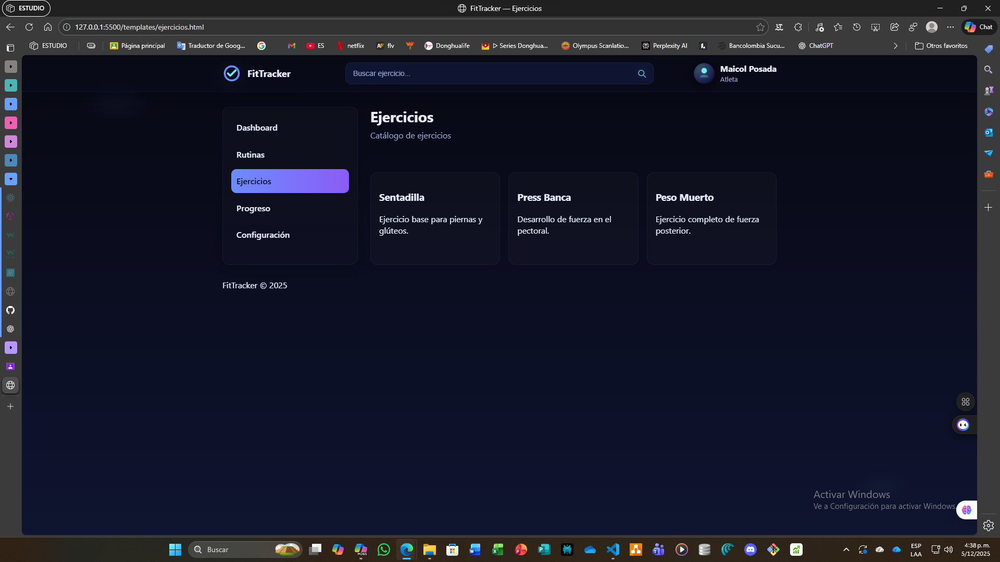
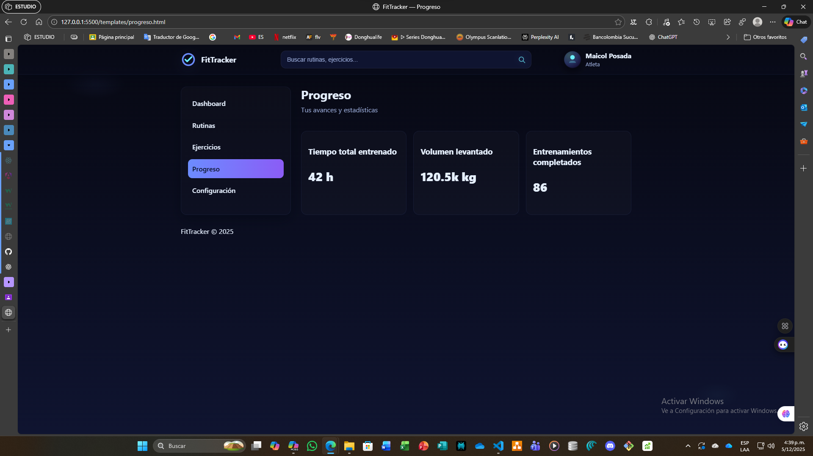
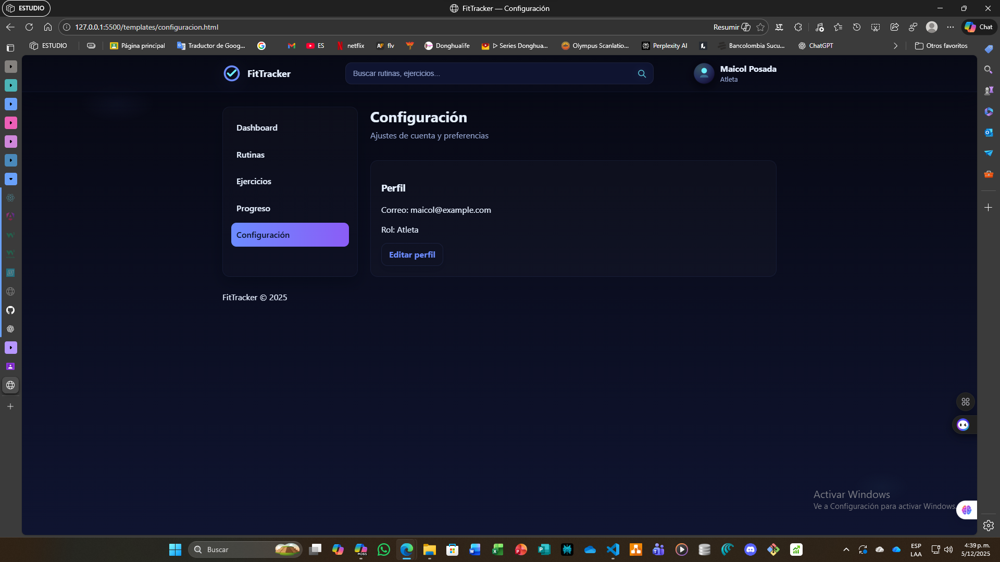
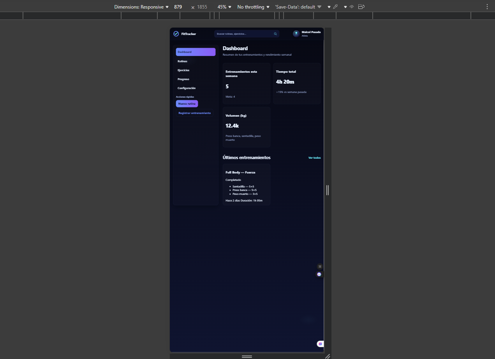
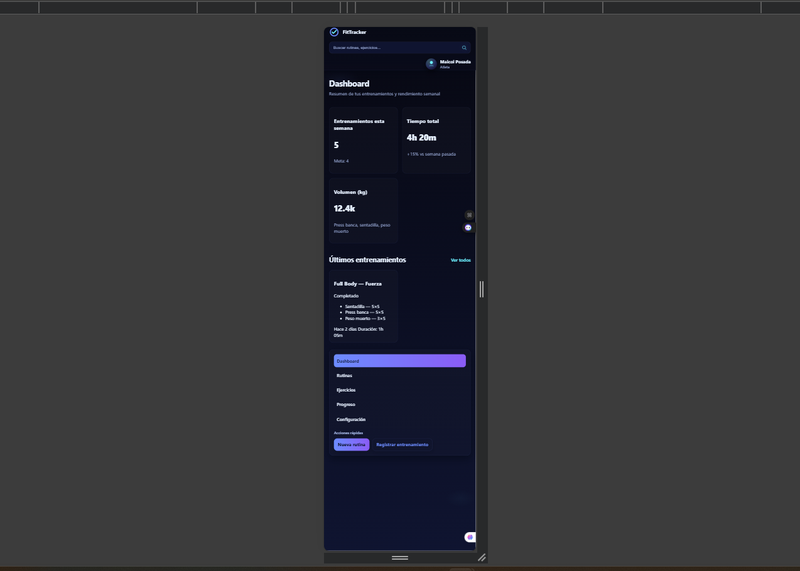

# FitTracker UI — Evidencia EV09

**Actividad:** GA1-220501096-03-AA1-EV09  
**Tema:** Maquetación web con HTML5 + CSS3 según prototipo **FitTracker – Workout Management**  
**Aprendiz:** Maicol Esneider Posada Callejas  
**Programa:** Tecnólogo en Análisis y Desarrollo de Software – SENA

---

## Descripción

Esta evidencia implementa la **interfaz gráfica** del dashboard **FitTracker** utilizando **HTML5** y **CSS3**, tomando como referencia el prototipo en Figma.  
Se priorizan etiquetas **semánticas**, layout con **Flexbox/Grid**, estilo **responsive** y separación clara entre estructura (`index.html`) y estilos (`styles/style.css`).  
> *No se usa JavaScript en esta entrega (EV09).*

---

## Objetivos

- Construir la maquetación base del dashboard FitTracker en HTML + CSS.  
- Aplicar etiquetas semánticas: `header`, `nav`, `main`, `section`, `article`, `footer`.  
- Organizar el layout con **Flexbox** y **CSS Grid**.  
- Asegurar **responsive** en desktop, tablet y móvil.  
- Entregar repositorio en GitHub: **`fittracker-ui`** con **README** y **capturas**.

---

## Configuración del Proyecto

### 1) Clonar el repositorio (o crear carpeta local)
```bash
git clone <URL-DE-TU-REPOSITORIO>
cd fittracker-ui
2) Estructura esperada
fittracker-ui/
├── index.html
├── styles/
│   └── style.css
├── assets/
│   ├── images/ 
│   │   ├── avatar-user.png
│   │   └── bg-dashboard.jpg
│   ├── icons/
│   │   ├── check.svg      
│   │   ├── logo.svg       
│   │   ├── menu.svg
│   │   ├── search.svg
│   │   ├── user.svg
│   │   └── workout.svg
│   ├── fonts/ 
│   │   └── fonts.css
│   └── img/
│       ├── pantallaso_comprobante_1       
│       ├── pantallaso_comprobante_2 
│       ├── pantallaso_comprobante_3
│       ├── pantallaso_comprobante_4
│       └── pantallaso_comprobante_5
├── templates/
│   ├── configuracion.html      
│   ├── ejercicios.html       
│   ├── progreso.html 
│   └── rutinas.html
│  
└── README.md/             
```
## 3) Cómo ejecutar
### Opción A — Abrir directo:

-Abre index.html en el navegador.

### Opción B — Live Server (VS Code):

-Clic derecho sobre index.html → Open with Live Server.

### Opción C — Servidor local con Python:
```bash 
Shellcd fittracker-uipython -m http.server 5500Mostrar más líneas
```
Accede en: http://localhost:5500

## Secciones maquetadas (Componentes de la UI)

-Topbar (header): marca, buscador y bloque de usuario.

-Sidebar (nav): menú principal y Acciones rápidas (botones).

-Contenido (main): ....

-Tarjetas de estadísticas: entrenamientos, tiempo total, volumen (kg).

-Últimos entrenamientos: grid de cards con estado (badges) y lista de ejercicios.

-Progreso semanal: barra de progreso construída con CSS.


-Footer: enlaces de soporte, privacidad y términos.
Tema oscuro con variables CSS y responsive por media queries.


## Capturas de Evidencia EV09 (Carpeta img/)

### vista general en el pc







### Responsive

**Vista tablet**



**Vista móvil**



**Vista pc**


## Checklist de la guía EV09

 -Maquetación en HTML5 + CSS3 (sin JS).
 -Uso de etiquetas semánticas.
 -Layout con Flexbox y Grid.
 -Diseño responsive (desktop/tablet/móvil).
 -Separación index.html / styles/style.css.
 -Capturas en carpeta img/ enlazadas en el README.
 -Repositorio en GitHub llamado fittracker-ui.


## Commits realizados 
 


## Estado del Proyecto

-Maquetación base completa del dashboard FitTracker.

-Tema, layout y responsive implementados.

-Capturas listas para agregarse en img/.

-Repositorio preparado para entrega.


## Conclusión

La EV09 permitió convertir el prototipo de Figma en una página real usando HTML y CSS, cuidando semántica, accesibilidad y responsive.
La estructura y estilo quedan listos para futuras mejoras (más pantallas, tipografías del Figma, iconografía y microinteracciones).